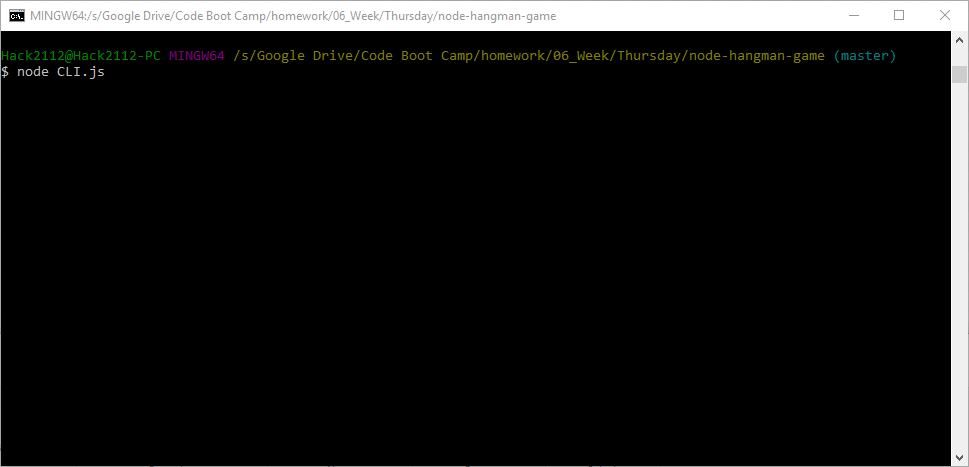

# Command Line Node Hangman: The Game!

Ever wanted to play a game of hangman, but wanted to do it in your terminal window? Well want no more! With this fabulous package you too can play hangman with a selection of films right in that very same terminal window! Take a peep down below!

## Getting Started

After cloning down the repository make sure you install the npm package. Run the hangman.js file in node through the command line and the game will begin!

### Prerequisites

1) Node.JS
2) The npm package inquirer
3) A terminal window

## Authors

* **Max Ackerman**

## Acknowledgments

* Thanks to UCF Coding Boot Camp for a fun project!

